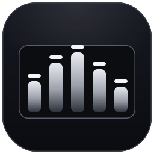
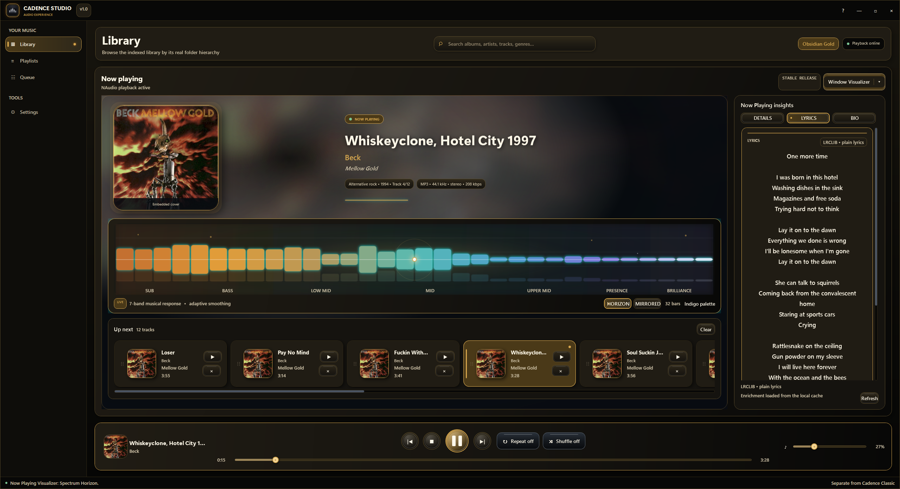
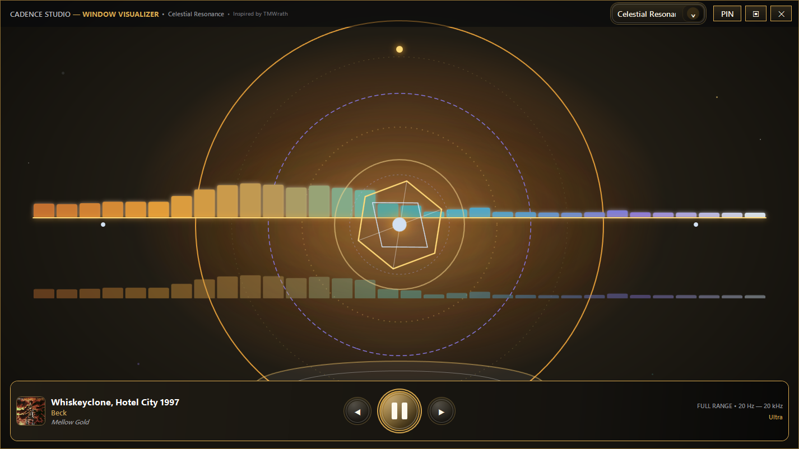
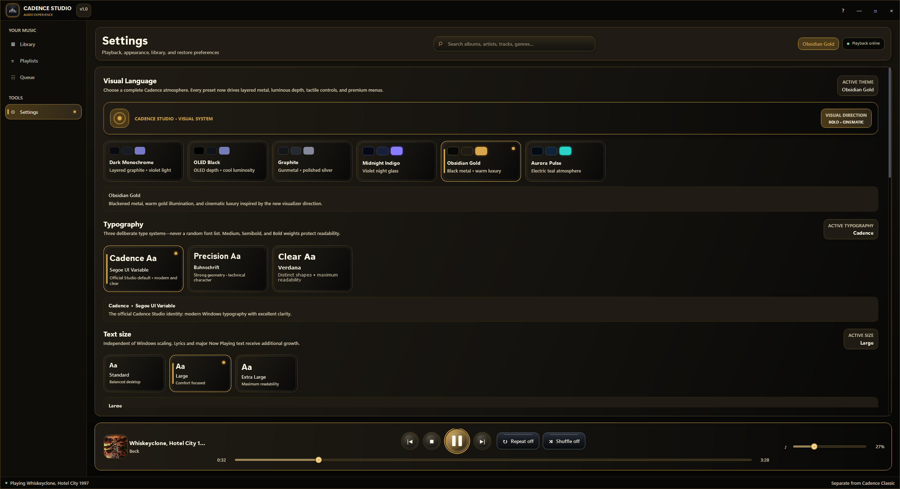

<p align="center">
  
</p>

<h1 align="center">Cadence Studio</h1>

<p align="center">
  A polished, local-first Windows music player built with C#, WPF, XAML, MVVM, NAudio, and TagLibSharp.
</p>

<p align="center">
  
  
  
  
  
  
</p>

<p align="center">
  <a href="release/"><strong>Release files</strong></a>
  ·
  <a href="RELEASE-NOTES.md">Release notes</a>
  ·
  <a href="CHANGELOG.md">Changelog</a>
  ·
  <a href="ROADMAP.md">Roadmap</a>
</p>

---

## Cadence Studio v1.0

Cadence Studio is a modern Windows music player focused on dependable local playback, expressive visuals, strong metadata tools, and a carefully designed desktop experience.

The first stable release was promoted only after installer, portable-package, upgrade, persistence, long-session playback, visualizer, recovery, and uninstall validation passed through the release-candidate cycle.

Cadence Studio is separate from **Cadence Classic**, the original PowerShell/WinForms application. Both projects retain independent codebases, settings, release histories, and development paths.

## Screenshots

<p align="center">
  
</p>

<p align="center"><em>Library, Now Playing, lyrics, queue, visualizer, and transport controls in one focused workspace.</em></p>

<p align="center">
  
</p>

<p align="center"><em>The detached Window Visualizer with responsive live audio, cinematic presets, and fullscreen support.</em></p>

<p align="center">
  
</p>

<p align="center"><em>Visual Language, theme isolation, typography profiles, and independent text sizing.</em></p>

## Highlights

### Playback and library

- Local music-library indexing with real folder hierarchy and fast cached startup.
- NAudio playback with seek, volume, shuffle, repeat, queue management, and clean shutdown.
- Persistent queue, playlists, playback position, workspace, window state, and appearance settings.
- M3U and M3U8 playlist import and export.
- Global Library search across artists, albums, tracks, and genres.

### Audio and visualization

- Real-time 10-band equalizer with presets, preamp, custom profiles, and headroom protection.
- Full-spectrum FFT visualizers with multiple densities, palettes, response controls, and reduced-motion support.
- Compact and expanded Now Playing workspaces.
- Detached Window Visualizer with **Celestial Resonance**, **Aurora Cascade**, **Glass Horizon**, and **Infinite Windows** presets.
- Song-change notifications with artwork, progress, and playback controls.

### Metadata and enrichment

- Embedded and folder artwork support.
- MusicBrainz matching and Cover Art Archive retrieval.
- LRCLIB lyrics and Wikipedia artist information.
- Single-track and full-album Metadata Workshops.
- Reviewable edits, backups, selective writes, artwork embedding, and post-write verification.

### Visual language and accessibility

- Six isolated themes: **Dark Monochrome**, **OLED Black**, **Graphite**, **Midnight Indigo**, **Obsidian Gold**, and **Aurora Pulse**.
- Three typography profiles: **Cadence**, **Precision**, and **Clear**.
- Standard, Large, and Extra Large text sizing independent of Windows display scaling.
- Built-in About, diagnostics, logs, cache locations, and Keyboard Shortcuts reference.

## Install and run

### Download a release

Prebuilt installers and portable packages are kept in the repository’s [**release directory**](release/).

### Windows installer

The installer is the recommended deployment. It installs per-user to:

```text
%LOCALAPPDATA%\Programs\Cadence Studio
```

It creates a Start Menu shortcut, offers an optional desktop shortcut, supports clean upgrades, and preserves Cadence Studio user data during uninstall.

### Portable packages

Two portable variants are produced:

- **Self-contained** — includes the .NET runtime and runs without a separate runtime installation.
- **Framework-dependent** — smaller package that requires the .NET 8 Desktop Runtime.

### Build from source

Requirements:

- Windows 10 or Windows 11
- .NET 8 SDK

```powershell
.\build.ps1 -Run
```

Debug output is written to:

```text
src\CadenceStudio.App\bin\Debug\net8.0-windows\CadenceStudio.exe
```

## Release packaging

Create portable packages only:

```powershell
.\packaging\New-Release.ps1 -SkipInstaller
```

Create the complete release set, including the Inno Setup installer:

```powershell
.\packaging\New-Release.ps1
```

The release script detects Inno Setup 6 from PATH, standard machine-wide locations, and the standard per-user location under `%LOCALAPPDATA%`. An explicit compiler path can also be supplied:

```powershell
.\packaging\New-Release.ps1 `
    -InnoCompilerPath "$env:LOCALAPPDATA\Programs\Inno Setup 6\ISCC.exe"
```

Generated packages, manifests, release notes, and SHA-256 checksums are written beneath:

```text
artifacts\release\<version>
```

See [Packaging Documentation](docs/PACKAGING.md) for the complete workflow.

## User data and privacy

Cadence Studio is local-first. It requires no account, subscription, telemetry, or mandatory cloud service.

```text
%LOCALAPPDATA%\CadenceStudio
├── session.json
├── playlists.json
├── cache
│   ├── library-index.json
│   ├── enrichment\<track-hash>.json
│   └── artwork\<musicbrainz-id>-500.jpg
└── logs\cadence-studio.log
```

Online enrichment is optional. Playback, local indexing, playlists, local metadata, and cached content remain available offline.

## Design principles

Cadence Studio aims for **controlled spectacle rather than clutter**: layered depth, tactile controls, expressive visualizers, strong typography, and clear hierarchy without sacrificing reliability, performance, or accessibility.

Stable v1.0 is a quality gate, not a schedule target. The application reached stable status only after fresh-install, upgrade, persistence, recovery, performance, long-playback, portable-package, installer, and uninstall validation passed.

## Documentation

- [Release files](release/)
- [v1.0 Validation Plan](RC-TEST-PLAN.md)
- [Testing Notes](TESTING.md)
- [Architecture](ARCHITECTURE.md)
- [Packaging Documentation](docs/PACKAGING.md)
- [Roadmap](ROADMAP.md)
- [Changelog](CHANGELOG.md)
- [Release Notes](RELEASE-NOTES.md)
- [Third-Party Notices](THIRD-PARTY-NOTICES.md)

---

<p align="center">
  <strong>Reliable. Functional. Polished. Eye Candy.</strong>
</p>
